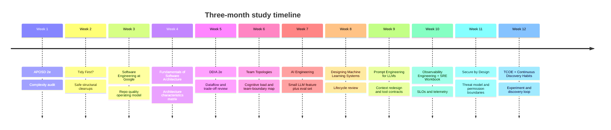

# High-ROI Reading List for Software Engineers in the Agentic AI Era

iturn27image0turn26image0turn26image1turn26image2

## Executive summary and selection logic

For a mid-to-senior software engineer moving into AI-enabled development, the highest-ROI skills are not “prompt tricks” in isolation. The strongest current evidence points toward a stack of durable capabilities: software design, architecture trade-off judgment, system boundaries, verification and evaluation, observability, security, and socio-technical operating models. Recent industry data shows broad developer adoption of AI tools but persistent trust and verification gaps, while current agent-building guidance from Anthropic and OpenAI emphasizes context engineering, tool design, evals, approvals, and tracing/observability rather than prompt wording alone. Your uploaded study plan points in the same direction, with heavy emphasis on architecture, evaluation, product engineering loops, UX/accessibility, and measurable outcomes. citeturn8search1turn7search0turn12view1turn33search1turn32search0 fileciteturn0file0

That is why this list is intentionally biased toward books that make you better at designing systems humans can trust, operating them under uncertainty, and steering AI-generated output into maintainable, testable, secure products. I ranked books using a synthesis of four factors: durability of insight, transferability across stacks, leverage on current AI-era bottlenecks, and time-to-payoff. I also discounted books whose core value is likely to be outpaced by fast-moving tool documentation, especially in IDE automation and narrow prompt recipes, because the frontier there is moving through official docs, SDKs, and standards faster than the book market. citeturn12view1turn33search3turn10search0turn9search1turn32search0

The net result is a top-20 list led by timeless software design and systems books, followed by production AI/ML engineering, observability and reliability, security, experimentation, and product/human-factors texts. If you only read five this quarter, I would start with **A Philosophy of Software Design**, **Designing Data-Intensive Applications**, **Software Engineering at Google**, **AI Engineering**, and **Team Topologies**. Those five together best cover the new bottleneck: humans increasingly specify, evaluate, and govern systems whose code is produced faster than ever. citeturn16search0turn20search1turn34search0turn20search0turn21search0turn38search1

## Top picks at a glance

The table below compares the ranked top 20 by a synthesized AI-era ROI score, estimated reading time, and dominant focus area. Reading times come from publisher/official pages where available; a few are estimated from page counts and technical density. citeturn16search0turn34search0turn36search1turn41search0turn37search0turn34search1turn40search8

| Rank | Book | ROI score | Time | Primary focus area | Primary source |
|---|---|---:|---:|---|---|
| 1 | *A Philosophy of Software Design* 2e | 10.0 | 4–6h | design, maintainability | citeturn16search0turn20search1 |
| 2 | *Designing Data-Intensive Applications* 2e | 9.9 | 21.9h | data systems, distributed systems | citeturn34search0turn20search0 |
| 3 | *Software Engineering at Google* | 9.7 | 14–16h | large-scale engineering, maintainability | citeturn26image1turn21search1 |
| 4 | *AI Engineering* | 9.6 | 15.9h | agentic AI, LLM systems, evals | citeturn40search8turn21search0 |
| 5 | *Fundamentals of Software Architecture* 2e | 9.4 | 14.7h | architecture trade-offs | citeturn36search0turn36search1 |
| 6 | *Team Topologies* 2e | 9.3 | 6–8h | org design, cognitive load | citeturn38search1turn38search9 |
| 7 | *Designing Machine Learning Systems* | 9.1 | 10–12h | ML engineering | citeturn40search10turn21search0 |
| 8 | *Observability Engineering* | 9.0 | 9.3h | observability, production feedback | citeturn37search0turn37search8 |
| 9 | *The Site Reliability Workbook* | 8.9 | 14.0h | SRE, SLOs, operations | citeturn34search1turn23search0 |
| 10 | *Secure by Design* | 8.9 | 9–11h | secure software design | citeturn40search1 |
| 11 | *Software Architecture: The Hard Parts* | 8.8 | 12.5h | distributed architecture trade-offs | citeturn41search0 |
| 12 | *Unit Testing: Principles, Practices, and Patterns* | 8.8 | 10–12h | testing, maintainability | citeturn40search0 |
| 13 | *Trustworthy Online Controlled Experiments* | 8.7 | 7–9h | experimentation, decision quality | citeturn28search2turn28search6 |
| 14 | *Continuous Discovery Habits* | 8.6 | 4–5h | product discovery, human factors | citeturn17search3turn15search1 |
| 15 | *Learning Domain-Driven Design* | 8.5 | 8.5h | domain modeling, bounded contexts | citeturn23search4 |
| 16 | *Tidy First?* | 8.5 | 2.0h | refactoring, change safety | citeturn29search3 |
| 17 | *Prompt Engineering for LLMs* | 8.3 | 8.0h | prompt/context engineering | citeturn14search1turn12view1 |
| 18 | *The Design of Everyday Things* | 8.2 | 7–9h | human factors, UX | citeturn18search4 |
| 19 | *Staff Engineer* | 8.1 | 7–9h | technical leadership | citeturn19search0turn19search2 |
| 20 | *Understanding Distributed Systems* | 8.0 | 8–9h | practical distributed systems | citeturn22search0 |

The chart maps approximate reading-time cost against synthesized ROI. Quick wins cluster in the upper-left; deep but longer-payoff texts sit toward the upper-right. citeturn16search0turn34search0turn36search1turn37search0turn34search1turn40search8

```mermaid
quadrantChart
    title ROI vs Time Investment
    x-axis Lower time --> Higher time
    y-axis Lower ROI --> Higher ROI
    quadrant-1 Long-haul staples
    quadrant-2 Quick wins
    quadrant-3 Low priority
    quadrant-4 Niche reads
    APOSD: [0.18, 0.97]
    DDIA2: [0.95, 0.98]
    SE@Google: [0.72, 0.95]
    AI Engineering: [0.75, 0.94]
    Fundamentals SA: [0.68, 0.92]
    Team Topologies: [0.32, 0.91]
    Designing ML Systems: [0.52, 0.89]
    Observability Eng: [0.40, 0.88]
    SRE Workbook: [0.66, 0.87]
    Secure by Design: [0.48, 0.87]
    Unit Testing: [0.50, 0.86]
    Tidy First?: [0.08, 0.83]
```

## Annotated ranked top 20

### *A Philosophy of Software Design* 2e

This remains the single best short book for retraining an experienced engineer’s design instincts. Ousterhout’s central claim is that software design is mostly about managing complexity, and he gives a vocabulary for doing that: deep modules, information hiding, tactical versus strategic programming, and “design it twice.” The reason it ranks first in the agentic era is simple: if AI systems increase code volume, the marginal value of human judgment shifts upward to boundaries, abstractions, and complexity control. Recent practitioner commentary around Ousterhout’s work explicitly makes that case. citeturn16search0turn16search2turn20search1

- Reduce cognitive load by hiding complexity behind deep modules rather than exposing implementation detail. citeturn16search0turn20search1
- Treat software design as an iterative decomposition problem, not a style-guide compliance exercise. citeturn16search2turn20search1

Target reader: experienced mid-level and senior engineers, tech leads, and architects. Estimated time: about 4–6 hours. Why it is high ROI now: it strengthens the exact judgment surface that code-generation tools do not reliably own—module boundaries, changeability, and long-range simplicity. Primary sources: official author page and recent expert discussion. citeturn16search0turn20search1

### *Designing Data-Intensive Applications* 2e

Kleppmann and Riccomini’s second edition is the best systems book for engineers who need to reason clearly about storage, replication, streaming, consistency, cloud trade-offs, and the consequences of design choices under load. The second edition explicitly brings the material up to cloud-native architecture and includes a stronger treatment of law and society, which matters more as AI products become data systems with user-facing consequences. It is long, but nothing else in the list upgrades distributed-systems intuition as reliably. citeturn34search0turn34search5turn20search0turn20search2

- Build mental models of trade-offs instead of memorizing fashionable architectures or services. citeturn34search0turn20search2
- Understand that AI applications still live or die on data movement, state, consistency, and failure handling. citeturn34search0turn34search5

Target reader: senior backend engineers, platform engineers, architects, and AI engineers who touch production systems. Estimated time: about 22 hours. Why it is high ROI now: nearly every serious AI product becomes a distributed data system, and this book gives the language for making good decisions rather than cargo-culting infrastructure. Primary sources: O’Reilly page and recent expert validation. citeturn34search0turn20search0turn20search2

### *Software Engineering at Google*

This is the strongest book on the difference between programming and software engineering at organizational scale. Its core ideas—optimizing for change over time, making policy and tooling reinforce quality, and treating documentation, review, testing, and ownership as first-class—have become more important, not less, as AI coding tools make code cheap. In practical terms, it teaches you how to keep a system coherent when many contributors, including AI-assisted ones, can produce code quickly. citeturn26image1turn21search1turn8search1

- Optimize for readability, reviewability, and changeability, because those dominate long-run engineering cost. citeturn26image1turn21search1
- Use sociotechnical mechanisms—standards, tooling, ownership, review, and documentation—to keep quality from depending on heroics. citeturn21search1turn7search0

Target reader: mid-to-senior engineers, staff engineers, and engineering managers. Estimated time: about 14–16 hours. Why it is high ROI now: AI expands code throughput, so the bottleneck shifts to review, validation, and long-term maintainability at team scale. Primary sources: official publisher metadata and contemporary coverage of Google’s tooling culture. citeturn26image1turn21search1

### *AI Engineering*

Chip Huyen’s book is the clearest current map from “I know software engineering” to “I can build production applications with foundation models.” It covers the AI stack, evaluation methodology, prompting, retrieval, fine-tuning, inference, UX, and application planning, but without pretending that today’s AI work is only about models. Its practical framing is exactly why it has landed so quickly in expert recommendations. citeturn40search8turn40search9turn21search0turn21search2

- Treat evals, interfaces, context, and product scope as core engineering concerns, not afterthoughts to model calls. citeturn40search9turn21search2
- Start from the application layer and move downward only as needed into model development and infrastructure. citeturn21search2turn40search8

Target reader: experienced software engineers moving into LLM and agentic-product work. Estimated time: about 16 hours. Why it is high ROI now: it is the closest thing to a canonical bridge text for software engineers entering production AI systems. Primary sources: O’Reilly page and recent expert interview/recommendation. citeturn40search8turn21search0turn21search2

### *Fundamentals of Software Architecture* 2e

Richards and Ford provide the most practical “architecture map” in this list: architectural characteristics, patterns, modularity, governance, decision-making, and trade-offs. The second edition matters because it explicitly incorporates current topics including generative AI and team topologies, while keeping the book grounded in architectural reasoning rather than trend-chasing. For engineers whose next step is architecture judgment rather than more syntax, this is one of the best investments. citeturn36search0turn36search1turn36search8

- Choose architectures by required characteristics and trade-offs, not by ideology. citeturn36search8turn36search12
- Architecture is continuous decision-making plus governance, not a one-time diagramming exercise. citeturn36search1turn36search10

Target reader: senior engineers becoming architects or technical leads. Estimated time: about 14.7 hours. Why it is high ROI now: agentic development raises the premium on engineers who can decide what kind of system should exist before it gets generated. Primary sources: official O’Reilly overview and chapter pages. citeturn36search0turn36search1turn36search10

### *Team Topologies* 2e

This is the best current book on the organizational side of software flow: stream-aligned teams, platform teams, enabling teams, complicated-subsystem teams, and above all, cognitive load. The 2025 second edition is especially relevant because it explicitly addresses AI and “infrastructure for agency” for humans and AI, while keeping the core focus on fast flow and humane, adaptable operating models. citeturn38search1turn38search7turn38search9

- Cognitive load is a design constraint for teams just as complexity is a design constraint for code. citeturn38search1turn38search9
- Platform and enabling capabilities matter more when teams must safely exploit AI acceleration without drowning in complexity. citeturn38search1turn38search7

Target reader: senior engineers, staff engineers, platform leads, engineering managers. Estimated time: about 6–8 hours. Why it is high ROI now: AI changes the cost of code, but not the need for healthy team boundaries, trust, stewardship, and flow. Primary sources: official second-edition pages and AI-era commentary from the authors’ site. citeturn38search1turn38search9

### *Designing Machine Learning Systems*

This is still one of the best books for understanding how ML systems fail and how to design them as systems, not just models. Although published before the current agentic wave, its lifecycle framing—data, training, deployment, monitoring, feedback loops, iteration—remains directly applicable to LLM and agentic products. It pairs especially well with *AI Engineering*: this one gives enduring systems instincts, while *AI Engineering* updates the application layer for foundation models. citeturn40search10turn25search1turn24search7turn21search0

- Learn to see ML products as pipelines with operational and organizational failure modes, not as isolated model artifacts. citeturn24search7turn25search1
- Build evaluation, deployment, and iteration loops early, because the biggest costs compound after launch. citeturn21search0turn24search7

Target reader: software engineers entering ML/LLM systems, ML engineers, AI product teams. Estimated time: about 10–12 hours. Why it is high ROI now: it strengthens the systems-engineering substrate underneath modern AI work. Primary sources: official publisher metadata and supporting ML systems guidance. citeturn40search10turn25search1turn24search7

### *Observability Engineering*

Majors, Fong-Jones, and Miranda explain why modern systems cannot be debugged adequately with legacy monitoring habits alone, and what observability-driven development actually looks like. That argument now matters even more because AI-assisted coding increases the amount of behavior you must validate in production. The recent second edition explicitly frames observability as central in the AI era, but the original book remains the most efficient on-ramp. citeturn37search0turn37search4turn37search8

- Instrument for high-cardinality, context-rich debugging so future engineers can understand today’s code in production. citeturn37search0turn37search4
- Treat observability as a feedback-loop accelerator for delivery, not as a passive cost center. citeturn37search8turn37search0

Target reader: senior backend, platform, and SRE-minded engineers. Estimated time: about 9.3 hours. Why it is high ROI now: as generated code volume rises, production understanding and verification become the real scarce resources. Primary sources: O’Reilly overview and AI-era second-edition chapter. citeturn37search0turn37search8

### *The Site Reliability Workbook*

Google’s workbook is the hands-on complement to SRE theory: SLOs, toil reduction, gradual change, incident handling, and practical adoption patterns. This is especially relevant for AI-enabled development because it teaches how to lower the cost of change without surrendering reliability—a crucial capability when more code, prompts, tools, and autonomous actions are entering production faster. citeturn34search1turn34search6turn34search8

- Use SLOs as an operating contract between speed and reliability. citeturn34search8
- Eliminate toil and automate recurrent operational work so engineering time buys resilience instead of repetitive reaction. citeturn34search6

Target reader: backend engineers, platform engineers, SREs, tech leads. Estimated time: about 14 hours. Why it is high ROI now: it turns reliability into a repeatable discipline at the same moment AI is increasing change velocity. Primary sources: official O’Reilly overview and chapter pages. citeturn34search1turn34search6turn34search8

### *Secure by Design*

This is one of the rare security books that teaches security as a design habit rather than a checklist. Its focus on domain primitives, validation, error handling, and structurally safer software fits the AI era well because modern agentic systems amplify the cost of unclear permissions, sloppy interfaces, and over-broad authority. That is directly aligned with current trustworthy-agent guidance and OWASP’s emphasis on excessive agency and insecure handling. citeturn40search1turn33search0turn13search5

- Make secure boundaries explicit in the design, instead of hoping downstream filters catch everything. citeturn40search1
- Use tighter domain modeling and safer primitives to reduce attack surface before runtime. citeturn40search1turn40search2

Target reader: senior developers, architects, backend and platform engineers. Estimated time: about 9–11 hours. Why it is high ROI now: AI and agents increase permissioning, tool-use, and prompt-injection risk, which makes secure-by-design thinking much more valuable. Primary sources: Manning page plus current trustworthy-agent and LLM security guidance. citeturn40search1turn33search0turn13search5

### *Software Architecture: The Hard Parts*

If *Fundamentals* teaches the map, this book teaches where the cliffs are. It centers on distributed architecture trade-offs: service granularity, contracts, workflows, transactions, decomposition, and dynamic/static coupling. That makes it ideal once you already have foundation-level architecture vocabulary and need to reason through messy real-world decisions under uncertainty. citeturn41search0turn41search6turn41search8

- Trade-off analysis is the real work of architecture; there are no universal best practices for hard distributed problems. citeturn41search0turn41search3
- Learn the specific failure and coordination costs introduced when decomposing systems. citeturn41search6turn41search8

Target reader: senior engineers and architects already comfortable with foundational architecture concepts. Estimated time: about 12.5 hours. Why it is high ROI now: AI systems increasingly span multiple services and tools, so explicit reasoning about boundaries and transactions matters more. Primary sources: official O’Reilly overview and part/chapter pages. citeturn41search0turn41search6

### *Unit Testing: Principles, Practices, and Patterns*

Khorikov’s book is one of the best treatments of test quality rather than test quantity. In an era where AI can generate many plausible tests cheaply, that distinction matters enormously. The book teaches how to tell valuable tests from brittle, low-signal suites and how better tests reinforce better design. citeturn40search0turn8search1

- Optimize tests for behavioral value and maintainability, not line-count theater. citeturn40search0
- Use testing as a design aid, but keep enough judgment to prune anti-patterns and dead-weight suites. citeturn40search0

Target reader: any engineer who writes or reviews tests regularly. Estimated time: about 10–12 hours. Why it is high ROI now: AI can help write tests, but humans still need to judge whether they are diagnosing the right risks. Primary source: Manning page. citeturn40search0

### *Trustworthy Online Controlled Experiments*

This is the most rigorous practical book on experimentation platforms, metrics, and trustworthy decision-making. That matters for AI products because model quality, UX, retrieval strategies, safety interventions, and agent workflow choices often cannot be settled by intuition alone. If you build product-facing AI, this book improves your ability to learn causally rather than argue rhetorically. citeturn28search2turn28search6

- Define good metrics and an overall evaluation criterion so local improvements do not sabotage long-term outcomes. citeturn28search6
- Build experimentation infrastructure and organizational habits that make trustworthy learning cheap enough to do often. citeturn28search2

Target reader: product engineers, data-informed leads, experimentation-platform engineers, AI product teams. Estimated time: about 7–9 hours. Why it is high ROI now: AI features are probabilistic, interactive, and easy to overrate without disciplined experimentation. Primary sources: Cambridge University Press book page and chapter overview. citeturn28search2turn28search6

### *Continuous Discovery Habits*

Teresa Torres’s book is not a coding book, but for product-minded engineers it is among the highest-leverage reads in the list. AI dramatically lowers the cost of building and iterating, which makes it even easier to optimize the wrong thing quickly. Torres’s framework—continuous interviewing, opportunity-solution trees, and assumption testing—helps keep discovery disciplined and close to real user value. citeturn17search3turn15search1turn17search8

- Use frequent customer contact and structured opportunity mapping to avoid solving low-value problems elegantly. citeturn17search3turn17search8
- Make discovery a sustainable operating habit, not a special phase before delivery. citeturn15search1turn17search7

Target reader: senior product engineers, tech leads, startup engineers, staff engineers working near product decisions. Estimated time: about 4–5 hours. Why it is high ROI now: AI shrinks build cost; therefore problem selection and user-value discovery become relatively more important. Primary sources: official book page and publisher listings. citeturn17search3turn15search1

### *Learning Domain-Driven Design*

Khononov’s book is the best modern practical DDD text for most engineers. It is especially strong on bounded contexts, domain analysis, coordination, and aligning software structure to business constraints. In the AI era, that matters because agents and services need clearer operating boundaries, shared language, and ownership than ever. citeturn23search4

- Model the domain explicitly so your software and your org share boundaries and vocabulary. citeturn23search4
- Use bounded contexts to prevent sprawling systems and ambiguous responsibility surfaces. citeturn23search4

Target reader: senior product engineers, architects, and backend leads. Estimated time: about 8.5 hours. Why it is high ROI now: clear domain boundaries make both human teams and AI agents easier to steer safely. Primary source: O’Reilly page. citeturn23search4

### *Tidy First?*

Kent Beck’s small book is a very high-leverage read because it is short, tactical, and immediately useful. Its power comes from clarifying the difference between changes to behavior and changes to structure, and from giving small, safe “tidyings” you can apply continuously. This pairs extremely well with AI pair-programming and code review because it promotes safe incremental cleanup instead of giant rewrites. citeturn29search3turn29search11

- Separate structural tidying from behavioral change so each is cheaper and safer. citeturn29search3turn29search11
- Prefer small, compounding refactorings that improve optionality without destabilizing delivery. citeturn29search3

Target reader: any practicing engineer with an existing codebase. Estimated time: about 2 hours. Why it is high ROI now: it gives a practical operating style for maintaining AI-accelerated code generation without accepting structural entropy. Primary source: O’Reilly page. citeturn29search3

### *Prompt Engineering for LLMs*

This is the best prompt-focused book I would currently recommend, but deliberately at a lower rank than architecture, testing, observability, and AI-systems books. That is not because prompting is unimportant; it is because current primary-source guidance increasingly treats prompt engineering as a subset of a larger discipline of context engineering, tool design, and runtime retrieval. Read this book for mechanics and tactics, but do not mistake it for the center of modern agent design. citeturn14search1turn14search9turn12view1turn32search0

- Learn prompt structuring, examples, workflows, and context presentation systematically rather than by folklore. citeturn14search1turn14search9
- Treat prompts as one part of a larger system that also includes tools, retrieval, memory, and evals. citeturn12view1turn33search1

Target reader: engineers already building LLM features who want a disciplined baseline. Estimated time: about 8 hours. Why it is high ROI now: it is still the fastest way to clean up brittle AI interactions, even if it is no longer sufficient by itself. Primary sources: O’Reilly page plus current agent/context-engineering guidance. citeturn14search1turn12view1turn32search0

### *The Design of Everyday Things*

Norman’s book is a classic because it teaches mental models, feedback, affordances, mappings, and constraints at a level that transfers across interfaces and decades. That is especially relevant for agentic software, where trust, permissioning, approvals, recoverability, and “what is the system doing right now?” become UX questions as much as technical ones. citeturn18search4turn33search0

- Good design reduces user confusion by making actions and consequences legible. citeturn18search4
- Human control, feedback, and sensible constraints are essential when systems become more autonomous. citeturn18search4turn33search0

Target reader: any engineer who ships user-facing systems, especially product engineers and AI UX builders. Estimated time: about 7–9 hours. Why it is high ROI now: as systems become more agentic, usability and trust become central engineering concerns rather than cosmetic ones. Primary source: publisher page. citeturn18search4

### *Staff Engineer*

Will Larson’s book is the best current guide to technical leadership beyond the management track. It is about leverage: working on what matters, aligning with authority, influencing across teams, and understanding the different staff archetypes. That is highly relevant in the AI era because the path upward is shifting away from “I personally wrote the most code” and toward “I created the most durable technical leverage.” citeturn19search0turn19search2turn19search5

- Staff-level impact is a mixture of technical taste, strategy, influence, and sponsorship, not just individual execution. citeturn19search0turn19search5
- Learn to prioritize work that changes system-wide outcomes, teams, and decision quality. citeturn19search2

Target reader: senior engineers moving toward staff/principal scope. Estimated time: about 7–9 hours. Why it is high ROI now: AI compresses the value of routine implementation and increases the value of system-level leverage, judgment, and guidance. Primary sources: official site and book guide pages. citeturn19search0turn19search2turn19search5

### *Understanding Distributed Systems*

Vitillo’s book is the most practical bridge between shallow system-design interview material and dense distributed-systems theory. It covers communication, coordination, scalability, resiliency, and maintainability in a form useful to working engineers. It is ranked lower mainly because *DDIA* covers more depth and breadth, but it is still one of the best additions if you want a more approachable path into large-scale systems. citeturn22search0

- Build a practical intuition for replication, failures, load distribution, and coordination without drowning in theory. citeturn22search0
- Use it as a bridge text if *DDIA* feels like too much to start with. citeturn22search0

Target reader: mid-level engineers growing into backend/system design ownership. Estimated time: about 8–9 hours. Why it is high ROI now: AI-enabled products still need boring distributed-systems competence to be reliable, fast, and maintainable. Primary source: official author site. citeturn22search0

## Expanded list by category

The detailed top 20 above is the prioritized path. The expanded list below adds strong second-tier books and companion resources by category. I have intentionally mixed books with a few non-book primary resources where the book market is lagging the state of practice, especially for agent tooling, IDE automation, and trustworthy agents. citeturn32search0turn12view1turn10search0

**Core design and architecture.** *A Philosophy of Software Design*; *Fundamentals of Software Architecture* 2e; *Software Architecture: The Hard Parts*; *Building Evolutionary Architectures* 2e; *Learning Domain-Driven Design*; *Tidy First?* These together cover decomposition, architecture characteristics, fitness functions, bounded contexts, and safe incremental change. citeturn16search0turn36search0turn41search0turn23search1turn23search4turn29search3

**System thinking and org design.** *Software Engineering at Google*; *Team Topologies* 2e; *Staff Engineer*; *An Elegant Puzzle*; *The Software Engineer’s Guidebook*. These are the best current sources on scale, cognitive load, career leverage, and the organizational side of quality. citeturn26image1turn38search1turn19search0turn31search0turn31search2

**Human factors and product discovery.** *Continuous Discovery Habits*; *The Design of Everyday Things*; *Don’t Make Me Think, Revisited*; *Refactoring UI*. This cluster is excellent for engineers who want to build systems that users can understand, trust, and adopt. citeturn17search3turn18search4turn17search0turn15search2

**Maintainability, testing, and release quality.** *Unit Testing: Principles, Practices, and Patterns*; *Tidy First?*; *Release It!*; *Trustworthy Online Controlled Experiments*. This group helps with test value, safe change, production robustness, and experimental rigor. citeturn40search0turn29search3turn18search3turn28search2

**Distributed systems, data, and reliability.** *Designing Data-Intensive Applications* 2e; *Understanding Distributed Systems*; *Site Reliability Engineering*; *The Site Reliability Workbook*; *Observability Engineering*. If your AI feature ever becomes a real product, this category starts paying rent immediately. citeturn34search0turn22search0turn23search0turn34search1turn37search0

**ML engineering and MLOps.** *Designing Machine Learning Systems*; *Machine Learning Design Patterns*; *Practical MLOps*; *Machine Learning Systems*; Google’s *Rules of Machine Learning*; “Hidden Technical Debt in Machine Learning Systems.” The books teach the operational discipline; the Google docs and paper remind you where ML systems quietly go wrong. citeturn40search10turn39view0turn35search0turn25search0turn25search1turn24search7

**Agentic AI and LLM systems.** *AI Engineering*; *Prompt Engineering for LLMs*; *Prompt Engineering for Generative AI*; *LLM Engineer’s Handbook*; *Build a Large Language Model From Scratch*; *Build a Reasoning Model From Scratch*. Read these after you have software design fundamentals, not instead of them. citeturn40search8turn14search1turn14search8turn14search0turn35search1turn35search6

**Security, ethics, and trustworthy AI.** *Secure by Design* should anchor the book side. Pair it with NIST’s GenAI profile, the OWASP Top 10 for LLM applications, Anthropic’s trustworthy-agents material, and the AI-security/agent-risk guidance now emerging in practice. This is one of the clearest cases where primary-source documents are moving faster than books. citeturn40search1turn13search0turn13search5turn33search0turn33search5

**Developer tooling, IDE automation, and interoperability.** Book coverage here is still weak. The most useful current resources are official docs and standards: OpenAI’s agent tooling and tracing platform, the OpenAI Agents SDK, MCP architecture docs, and Anthropic’s context-engineering guidance. For book companions, *Software Engineering at Google* and *The Software Engineer’s Guidebook* remain the best broadly useful reads on tooling, workflows, and developer effectiveness. citeturn32search0turn9search1turn10search0turn12view1turn26image1turn31search2

**Influential companion papers and essays worth reading alongside the books.** “Attention Is All You Need” for the transformer baseline that underlies most LLM thinking; Google’s “Hidden Technical Debt in Machine Learning Systems” for operational realism; Anthropic’s “Demystifying evals for AI agents” for current agent-evaluation practice; and OpenAI’s agent platform notes for tool/orchestration/observability patterns. These are not substitutes for books, but they tighten the connection between timeless engineering principles and current AI practice. citeturn12view1turn24search7turn33search1turn32search0

## Three-month study plan

This plan assumes roughly 8–10 focused hours per week. It is optimized for someone who already knows how to ship software and wants maximum compounding benefit: each week pairs reading with an artifact you can produce in your own work—an ADR, an eval harness, an SLO draft, a refactoring pass, or an interview summary. That structure follows the same feedback-loop logic emphasized in your study plan, in modern observability, and in current agent-evaluation guidance. citeturn0file0turn37search8turn33search1

| Week | Reading focus | Weekly goal |
|---|---|---|
| Week 1 | *A Philosophy of Software Design* 2e | Write a one-page “complexity audit” for a current service or codebase. |
| Week 2 | *Tidy First?* + selected APOSD notes | Refactor one pain point using only small structural tidyings; document before/after complexity. |
| Week 3 | *Software Engineering at Google* | Define a lightweight quality operating model: review, docs, ownership, and test expectations for one repo. |
| Week 4 | *Fundamentals of Software Architecture* 2e | Produce an architecture characteristics matrix for one important system. |
| Week 5 | *Designing Data-Intensive Applications* 2e | Redraw one system around state, data flows, failure modes, and consistency trade-offs. |
| Week 6 | *Team Topologies* 2e | Map your team’s cognitive load, interfaces, and platform/enabling needs. |
| Week 7 | *AI Engineering* | Build a small LLM feature with an explicit eval set, failure taxonomy, and rollback criteria. |
| Week 8 | *Designing Machine Learning Systems* | Review your AI feature as a lifecycle system: data, feedback loops, observability, and maintenance. |
| Week 9 | *Prompt Engineering for LLMs* + Anthropic context-engineering article | Replace brittle prompts with a structured context strategy, canonical examples, and cleaner tool boundaries. |
| Week 10 | *Observability Engineering* + *Site Reliability Workbook* | Add tracing/telemetry and define SLOs for your AI or service workflow. |
| Week 11 | *Secure by Design* | Threat-model the same workflow: permissions, input validation, output handling, tool scope, and approvals. |
| Week 12 | *Trustworthy Online Controlled Experiments* + *Continuous Discovery Habits* | Define one user-facing experiment and one discovery loop to validate whether the feature actually matters. |



If you want a lighter version of the same plan, keep Weeks 1–4, 7, 10, and 11. If you want a deeper version, extend DDIA across two weeks and add *Software Architecture: The Hard Parts* plus *Learning Domain-Driven Design* in a second quarter. That sequencing reflects the same underlying bet as the rankings themselves: in the agentic AI era, durable engineering advantage comes from better judgment about boundaries, feedback loops, trustworthiness, and operating models—not from faster code generation alone. citeturn34search0turn41search0turn23search4turn8search1turn33search1turn32search0